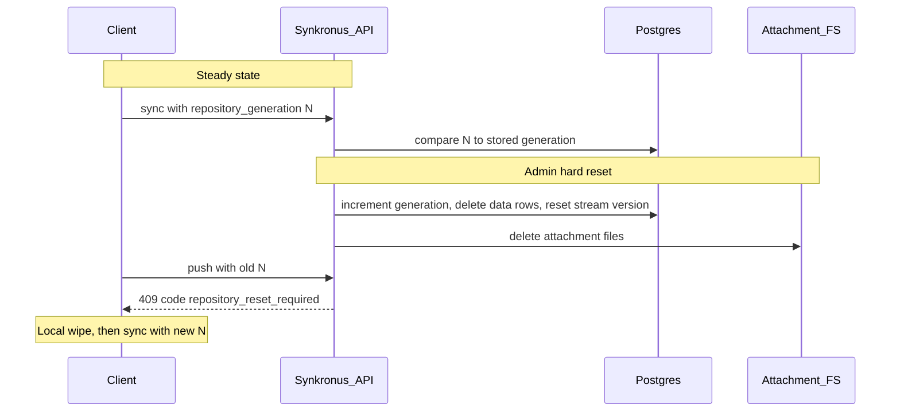

# Plan: Hard repository reset & repository generation (v2)

## Mandatory reading for implementers

Before writing or changing code, **read and follow** the repository’s guides:

- Root **[`AGENTS.md`](../../AGENTS.md)** — monorepo map, cross-cutting contracts, CI pointers.
- Root **[`README.md`](../../README.md)** and any **README** in packages you modify.
- **[`synkronus/AGENTS.md`](../../synkronus/AGENTS.md)** — REST/OpenAPI/`documentation/` alignment, lowercase HTTP headers, one public API for all clients.
- **[`synkronus/README.md`](../../synkronus/README.md)** — database, env, running the server.
- **[`synkronus/documentation/sync-protocol.md`](../../synkronus/documentation/sync-protocol.md)** — sync semantics; update it for generation and reset behavior.
- For **Formulus**: [`formulus/AGENTS.md`](../../formulus/AGENTS.md), [`formulus/README.md`](../../formulus/README.md), and patterns in `ServerSwitchService` (narrower reset than full server switch).
- For **CLI**: [`synkronus-cli/AGENTS.md`](../../synkronus-cli/AGENTS.md), [`synkronus-cli/README.md`](../../synkronus-cli/README.md).
- For **Portal**: [`synkronus-portal/AGENTS.md`](../../synkronus-portal/AGENTS.md), [`synkronus-portal/README.md`](../../synkronus-portal/README.md).
- Follow **links** from those docs (OpenAPI, opendataensemble.org references) and match **existing code style** in each package.

## Out of scope for this plan

Do **not** implement here:

- **User last-seen / presence** tables, throttled presence middleware, or admin “who was active” metadata. That is **[`plan_last_seen_v2.md`](./plan_last_seen_v2.md)**.

## Problem statement

`sync_version.current_version` is a **stream cursor** (moves on every change). After a **server-side wipe** of observation/attachment data, clients can still hold old cursors and **re-push stale data** unless the server exposes a separate **epoch** (`repository_generation`) and **refuses** writes from clients that have not adopted the new epoch.

## Concepts

| Concept | Role |
|---------|------|
| `current_version` | Monotonic observation stream position — unchanged in meaning. |
| `repository_generation` | Integer epoch — increments **only** on admin reset (or equivalent), not on every edit. |

Keep them **separate** in schema and docs.

## Server: migration and storage

- Extend `sync_version` (or adjacent single-row table) with **`repository_generation`** (default `1`), **`last_reset_at`**, **`last_reset_by`** as designed for your migrations.
- Confirm all tables that hold syncable data in your deployment; typically **`observations`**, **`attachment_operations`**, and related rows — verify against `synkronus/pkg/migrations/sql/`.

## Server: admin hard reset (destructive)

Single coherent operation (document exact HTTP path and body in OpenAPI), for example:

1. **Authentication:** JWT with **admin** role only.
2. **Confirmation body:** e.g. `{ "confirm": "RESET_REPOSITORY" }` to prevent accidental scripts.
3. **Database transaction** (order may be adjusted to satisfy FKs; document final order):
   - Increment `repository_generation`, set `last_reset_at`, `last_reset_by`.
   - Delete observation and attachment-operation rows (and any dependent rows required by schema).
   - Reset `sync_version.current_version` to the baseline aligned with Formulus `since` defaults (1 or 0 — **one** choice, documented).
4. **Filesystem:** remove attachment files under configured data dirs (see `synkronus/pkg/attachment/` / config). Define behavior if DB commits but FS delete fails (fail the request vs. repair job — pick one and document).
5. **App bundle / forms:** default is **out of scope** for wipe unless product requires a flag (e.g. preserve `data/app-bundle/`); state explicitly in OpenAPI and ops docs.

**Naming:** the public route and summary must reflect **irreversible data destruction** on the server, not “bump” or “soft invalidate” only.

## Server: gating (hot path)

- Compare client-supplied generation to stored value on **every path that can reintroduce data**, including **`POST /api/sync/push`** and **attachment upload/manifest** as applicable — **not** push alone.
- Accept generation via **header** and/or **JSON fields** where bodies already exist; keep names consistent with OpenAPI (lowercase header names in code per `synkronus/AGENTS.md`).
- Return **HTTP 409** with a **stable `code`** (e.g. `repository_reset_required`) so clients do not parse free-form messages. Extend error schema in OpenAPI and handlers consistently (`synkronus/internal/handlers/common.go` patterns).

## Responses

- Include `repository_generation` on **pull**, **push**, and attachment flows as needed so clients refresh without extra round trips.

## Clients

- **Formulus:** persist generation; on mismatch / 409, run a **narrow** local wipe (observations, attachments, sync keys) **without** treating it as full server URL switch unless product says otherwise — see `ServerSwitchService` for patterns to reuse or avoid.
- **synkronus-cli:** store generation; send on sync commands per regenerated client.
- **synkronus-portal:** admin UI for the reset action (recommended), same API as other clients.

Regenerate OpenAPI-derived clients where the repo does so today.

## Backwards compatibility

- Additive response fields: generally safe for old clients.
- After **generation &gt; 1**, enforcing safety may **require** clients that send generation; document rollout and minimum app versions for the first production reset.

## Testing and docs

- Integration: reset wipes DB rows and attachment FS; client with old generation cannot push; after adopting new generation, sync works.
- Update **`synkronus/openapi/synkronus.yaml`**, **`synkronus/documentation/sync-protocol.md`**, and an operator-facing note (README or `documentation/`) per repo conventions.

## Architecture sketch

## Deliverables checklist

| Area | Work |
|------|------|
| DB | Migration(s), constraints, documented rollback story if any |
| Go | Service: reset transaction, gate reads/writes, attachment paths |
| HTTP | Admin reset handler + OpenAPI + stable error `code` |
| Clients | Formulus, CLI, Portal per package AGENTS |
| Tests | Integration coverage for wipe + gating |
| Docs | sync-protocol, README links, version bump in OpenAPI `info.version` |
