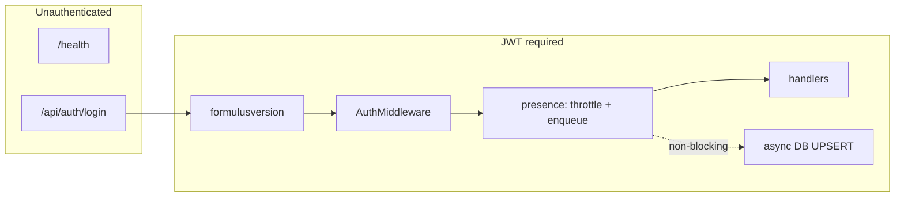

# Plan: Last-seen / user presence (v2)

## Mandatory reading for implementers

Before writing or changing code, **read and follow** the repository’s guides:

- Root **[`AGENTS.md`](../../AGENTS.md)** — monorepo map, cross-cutting contracts, where to find package-specific guides.
- Root **[`README.md`](../../README.md)** and any **README** in packages you touch.
- **[`synkronus/AGENTS.md`](../../synkronus/AGENTS.md)** — Synkronus Go layout, HTTP header conventions (lowercase), OpenAPI + `documentation/` sync.
- **[`synkronus/README.md`](../../synkronus/README.md)** — local dev, env, API entry points.
- Follow **links from those files** (e.g. `synkronus/documentation/`, OpenAPI, deployment docs) for anything you implement.
- Match **coding standards and patterns** already used in the touched packages (imports, error handling, logging, tests). Prefer extending existing types and routes over parallel mechanisms.

If work spills into Portal, CLI, or Formulus, read that package’s **`AGENTS.md`** and **`README.md`** as well.

## Out of scope for this plan

Do **not** implement here:

- **Repository generation**, **hard server reset**, mass `DELETE` of observations or attachments, or **invalidating all clients** via a generation epoch. That is **[`plan_hard_reset_v2.md`](./plan_hard_reset_v2.md)**.
- Changing core sync semantics (409 for generation mismatch, admin wipe endpoints) unless strictly required for presence storage.

## Goal

Operators and admins can see **when users/devices were last active** and light metadata (sync cursor hint, app bundle version), without slowing API responses. Presence is **best-effort** and **non-blocking**.

## Architecture (Synkronus)

- **Public** routes (e.g. `/health`, `/api/auth/login`) — **no** presence middleware.
- **Protected** routes (JWT): `formulusversion` → `AuthMiddleware` → **presence middleware** (enqueue only) → handlers.
- User identity: context from auth middleware (e.g. `GetUserFromContext`).

## Non-blocking writes

- Middleware and hooks use a **presence recorder**: throttle `(username, client_id)` in-process, then **enqueue** to a **bounded** queue; workers `UPSERT` with a detached/timeout context, **not** `r.Context()`.
- If the queue is full, **drop** and log — API responses must still succeed.
- **Shutdown**: document best-effort loss of in-flight presence writes.

## Data model

- New goose migration under `synkronus/pkg/migrations/sql/`.
- Table (name may vary), e.g. **`user_client_presence`**:
  - `username` → `REFERENCES users(username) ON DELETE CASCADE`
  - `client_id` `TEXT NOT NULL` (use `''` if unknown so `(username, client_id)` PK works)
  - `last_seen_at` `TIMESTAMPTZ NOT NULL`
  - `last_data_version` `BIGINT NULL`
  - `app_bundle_version` `TEXT NULL`
  - Optional: `last_ode_version` `TEXT NULL`
  - Indexes for admin listing as needed.

Schema is **additive** only.

## Middleware

- Package under e.g. `synkronus/pkg/middleware/presence/` — avoid naming collisions with `pkg/presence` recorder types.
- After JWT: read user from context; optional headers (e.g. client id) if documented; **never** await DB.
- Register in `synkronus/internal/api/api.go` inside the protected group, **after** `AuthMiddleware`.
- **CORS**: add any new custom headers to `AllowedHeaders` if browser clients send them.

## Handler hooks (server-side enrichment)

Sync JSON already includes `client_id`; body is not available in generic middleware before read:

| Location | Record (enqueue, same async path) |
|----------|-----------------------------------|
| Successful **Pull** | `client_id`, `since.version` (or 0), `last_seen_at` |
| Successful **Push** | `last_data_version` from response `current_version` |
| **App bundle manifest** (authenticated) | `app_bundle_version` from resolved manifest |

Optional: `x-ode-version` / `x-formulus-version` via existing middleware for `last_ode_version`.

## Admin API

- Extend admin **list users** (or dedicated route) to expose optional **`lastSeenAt`**, **`clients[]`**, etc., with backwards-compatible JSON.
- Update **`openapi/synkronus.yaml`** and a short narrative doc under `synkronus/documentation/`; link from `synkronus/README.md` if appropriate.

## Testing

- **Synkronus:** Unit: repository UPSERT, throttle, queue-full drop, shutdown. Integration: authenticated traffic updates presence; login/public routes do not; no blocking on request path (mocks that would detect awaits).
- **synkronus-cli:** Add or extend tests where the repo already does for similar features (e.g. client parsing, command output, flag handling) — follow existing patterns in `synkronus-cli`.
- **synkronus-portal:** Add tests where relevant (e.g. formatting helpers, thin logic extracted from `Dashboard` if needed) — follow existing ESLint/Prettier and test conventions in that package.

## Formatting (before review / PR)

Run on touched packages so diffs stay clean and CI stays green:

- **Go** (`synkronus`, `synkronus-cli`, and any other edited Go modules): `go fmt ./...` (or format only changed packages).
- **synkronus-portal** (TypeScript/JSON touched by codegen or hand edits): `npm run format` from `synkronus-portal/` (see `package.json`).

## PR description (final step)

Before opening the PR, produce a **concise summary** suitable for pasting into the PR body so reviewers can orient quickly:

- **What** changed (Synkronus / CLI / Portal — scope per package).
- **Why** (presence / last-seen for operators; non-blocking writes).
- **Notable details**: new migration, new headers, OpenAPI/client regen, admin-only fields, any behavior caveats (best-effort, queue drop).
- **How to verify**: e.g. local steps, key tests, or manual checks.

Match the repository’s PR template and tone if one exists. For ODE-style markdown body text, the **[`pr-description` skill](./skills/pr-description/SKILL.md)** documents the expected format.

## Deliverables checklist

| Item | Notes |
|------|--------|
| Migration + repository | Goose, FK to `users` |
| `pkg/presence` recorder | Throttle + bounded queue + workers |
| Middleware + `api.go` wiring | After JWT; CORS if needed |
| Sync + app-bundle hooks | Non-blocking enqueue |
| Admin list / OpenAPI / docs | Per `synkronus/AGENTS.md` |
| CLI + Portal | OpenAPI regen, `user list` / presence display, Users tab panel; docs + completion notes per extended plan |
| Tests | Synkronus + CLI/Portal where relevant (see Testing) |
| Formatting | `go fmt` on Go changes; `npm run format` in portal when applicable |
| PR description | Short paste-ready summary for reviewers (see PR description section) |
