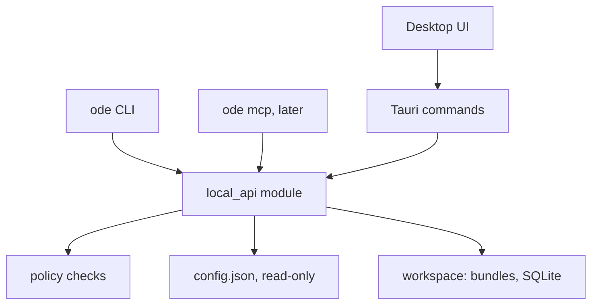

# ODE local AI integration prototype

## TL;DR

- Add a headless **`ode` CLI** that ships with ODE Desktop and reuses the Desktop Rust code (second binary in `desktop/src-tauri`).
- **ODE Desktop is the source of truth**: the CLI reads Desktop's `config.json` and never writes to it.
- Add two profile settings: **Available to local tools** (on by default) and **Allow agent access to data and attachments** (off by default).
- Commands: `profiles list`, `forms list`, `forms show`, `data export`, `forms validate`, and the `app` authoring commands (`status`, `checkout`, `dev`, `validate`, `push`). All output is JSON.
- Two more profile settings, both off by default:
  - **Allow agents to manage the app bundle** gates developer mode and the dev mirror.
  - **Allow agents to push the app bundle to Synkronus** gates deployment.
- New users can start from scratch: a skill creates a profile and sets up a local custom app from the ODE `custom_app` template.
- Permissions are checked in shared Rust code, not by asking the LLM to behave.
- Add MCP later as `ode mcp`, using stdio and the same operations. No HTTP server.
- Finally, ship Agent Skills (describe app/form/question, analyze export, edit form), publish an "AI agent support" docs section, and write a website manuscript.
- Defer anonymization, audit logs, client registrations, and aggregate queries.

## Principles

1. **One core, thin adapters.** Tauri commands, the CLI, and MCP call the same plain Rust functions that take paths, not `tauri::State`.
2. **Extract only what we use.** Move code out of `lib.rs` only when a CLI command needs it. No broad refactor.
3. **Deny by default for data.** Form definitions are metadata. Observations, counts, and attachments are data.
4. **Never expose secrets or internal paths.** Profile output contains only `id`, `label`, `active`, and permissions.
5. **Stable machine contract.** JSON goes to `stdout`, progress to `stderr`, and failures use a nonzero exit code. Every response includes `schemaVersion: 1`.

## Architecture



### Code layout

| Item | Location |
|---|---|
| Core module | `desktop/src-tauri/src/local_api/` (`mod.rs`, `config.rs`, `policy.rs`, `profiles.rs`, `forms.rs`, and later `export.rs`) |
| CLI binary | `desktop/src-tauri/src/bin/ode.rs`, using `clap` and calling `odedesktop_lib::local_api` |
| Existing exporter | Reuse `data_export.rs`; add a form filter and progress callback that does not depend on Tauri |
| Config discovery | `<OS config dir>/org.opendataensemble.custodian/config.json`, with `--config <path>` for tests and overrides |

### Extraction targets in `lib.rs`

Keep the extracted code minimal. Leave the existing Tauri commands as thin wrappers.

- `load_app_config` and the `AppConfigFile`/`ServerProfile` types (reading only)
- `bundle_form_roots`, `bundle_segment`, and `sanitize_form_type_id`
- The bodies of `list_active_bundle_forms` and `read_bundle_form_spec`
- The row-loading part of `export_observations_parquet`

### Concurrency

SQLite is opened **read-only** for exports, so it is safe to run while Desktop is open.

The CLI writes `config.json` only in Phase 4, and only in two ways:

- It updates the two developer-mode fields (`customAppDeveloperMode`, `customAppLocalFolder`).
- It creates a new profile (`ode profiles create`).

Rules for these writes:

- Each write goes through one function in `local_api::config`: `update_profile` or `create_profile`. The function re-reads the file, patches it, and does an atomic write-and-rename.
- The CLI never changes permissions, server URLs, or credentials on an existing profile.
- Desktop records the file's mtime. It reloads `config.json` when the mtime changes, checked in `get_settings` (the frontend calls it on refresh) and immediately before `persist_config`, so it never overwrites an external change.
- Everything else in `config.json` stays Desktop-only.

## Policy

Add these fields to `ServerProfile` with `serde(default)`:

| Field | Default | Grants |
|---|---:|---|
| `localToolsEnabled` | `true` | Profile discovery, form list, and form definitions |
| `localToolsAllowData` | `false` | `data export`, including attachments when requested |
| `localToolsAllowAuthoring` | `false` | Phase 4: `app status` source paths, `app checkout`, `app dev`, `app push` dry run |
| `localToolsAllowPush` | `false` | Phase 4: `app push --yes`. It requires `localToolsAllowAuthoring`, and the checkbox is disabled until that is on. |

UI labels:

- **Available to local tools**
- **Allow agent access to data and attachments**
- **Allow agents to manage the app bundle (developer mode)**
- **Allow agents to push the app bundle to Synkronus**

One-time confirmations:

- **Authoring:**
  > Local tools, including AI assistants, will be able to switch this profile to developer mode and point it at a local custom app folder. Nothing is sent to the server.
- **Push:**
  > Local tools, including AI assistants, will be able to publish new app bundles to the Synkronus server using your saved credentials. Published bundles reach all devices on their next sync.

Profiles created by `ode profiles create` start with authoring **on** and push **off**. They have no server, no credentials, and no data, so authoring is harmless. Pushing still requires the user to add a server and credentials in Desktop and to enable push.

Rules:

- If `localToolsEnabled` is off, the profile is invisible to the CLI.
- Every data operation calls one function: `policy::require(profile, Capability::Data)`.
- There are no CLI flags or environment variables that can bypass policy.
- Errors are structured:

```json
{
  "schemaVersion": 1,
  "error": {
    "code": "permission_denied",
    "capability": "data",
    "profileId": "study-a",
    "message": "Agent access to data and attachments is disabled for this profile. Enable it in ODE Desktop → Profiles → Local tools."
  }
}
```

Use `Capability` as an enum so we can add capabilities later without changing call sites.

### Desktop UI

On the profile page, add a **Local tools** section with two toggles.

When **Allow agent access to data and attachments** is enabled, show this one-time confirmation:

> Local tools, including AI assistants, will be able to export collected responses and attachments from this profile. If a tool uses a remote AI service, that data may leave this device.

## CLI contract

```bash
ode profiles list
ode forms list   --profile <id>
ode forms show   <form-type> --profile <id>
ode data export  --profile <id> --form <form-type> [--form ...] --destination <dir> \
                 [--include-pending] [--include-attachments] [--overwrite]
ode forms validate <form-dir>        # Phase 3

# Phase 4: authoring (all need --profile)
ode app status    --profile <id>                  # dev mode, source folder, local + server bundle versions
ode app checkout  --profile <id> --dest <dir>     # copy the active bundle to a new source folder
ode app dev on|off --profile <id> [--source <dir>]  # toggle developer mode, refresh the dev mirror
ode app validate  --profile <id>                  # validate the source folder (structure + every form)
ode app push      --profile <id> [--yes]          # dry run by default; --yes publishes (needs push permission)
ode profiles create --label <name> [--source <dir>]  # new local profile (authoring on, push off)
ode skills list | show <name> | install --dest <dir>  # Agent Skills (Markdown)
```

- JSON is the only output format. There is no `--json` flag.
- `--profile` is always required for profile-specific commands. The CLI never implicitly uses the active profile.
- `data export` requires at least one `--form`.
- `forms list` and `forms show` use the same form roots as Desktop (`bundle_form_roots`). When the profile has developer mode on, forms from `bundles/dev-local/forms/` are included and are equally valid. This supports profiles that have no Synkronus server.

### `forms show` output

```json
{
  "schemaVersion": 1,
  "formType": "household",
  "schema": {},
  "uiSchema": {},
  "fields": [
    { "path": "village", "type": "string", "title": "Village", "format": null, "attachment": false }
  ]
}
```

`fields` is a flattened view of `schema.json`. It is derived from metadata only and is not based on observations.

### `data export`

The command produces the existing Desktop export layout plus `manifest.json`:

```json
{
  "schemaVersion": 1,
  "createdAt": "2026-10-01T10:00:00Z",
  "odeVersion": "1.3.3",
  "profile": { "id": "study-a", "label": "Study A" },
  "options": { "includePending": false, "includeAttachments": false },
  "forms": [
    { "formType": "household", "rows": 120, "parquet": "household.parquet", "fields": [] }
  ],
  "attachments": { "copied": 0, "missing": 0 },
  "notice": "This export may contain sensitive personal data."
}
```

- Paths are relative to the export directory.
- `fields` uses the same shape as the `fields` array returned by `forms show`.
- The Desktop Export page also writes the manifest, so CLI and UI exports produce the same files.

## Phases

### Phase 1: Core, policy, and metadata (done)

1. Add the `local_api` module with config loading and profile DTOs that redact sensitive values.
2. Add the two policy fields and their Desktop toggles.
3. Implement `ode profiles list`, `ode forms list`, and `ode forms show`.
4. Make the Tauri `list_active_bundle_forms` and `read_bundle_form_spec` commands delegate to `local_api`.

**Done when** an agent in VS Code or Positron can discover profiles and explain a form without being able to read observations.

Added after agent testing:

- `--profile` accepts a profile label as well as an id.
- `fields` follow the `ui.json` order and include `choices` and `linkedForm`.
- Profiles → Local tools has a **Copy initial prompt for AI assistant** button.
- Export load snippets (UI and files, all four languages) start with a comment pointing to the CLI.
- Desktop locates the CLI next to its own executable (`get_local_tools_cli_path`).

### Phase 2: Data export (done)

1. Add a form filter and a non-Tauri progress callback to `data_export.rs`.
2. Add manifest generation for both the UI and CLI export paths.
3. Implement `ode data export` with policy enforcement.

**Done when** an export is denied by default and, once enabled, exports only the requested forms with a manifest.

As built:

- The existing `export_manifest.json` was upgraded instead of adding a second manifest.
  - It gained `schemaVersion`, `profileId`, and `forms[]` (Parquet file, row count, and fields with their `column`).
  - It dropped the absolute workspace attachment paths.
- The Parquet files stay at the top of the export folder, so the existing layout is unchanged.
- The Desktop UI and the CLI share `local_api::export::export_context`. It supplies the profile id, the snippet hint, and the bundle field metadata.
- The CLI opens SQLite read-only.
- Forms that exist but have no rows are reported in `formsWithoutRows`. Unknown forms fail with `form_not_found`.
- The copied agent prompt mentions `ode data export` when data access is enabled.

### Phase 3: Form validation (done)

Implement `ode forms validate <dir>` with this scope:

- Parse `schema.json` and `ui.json`.
- Check that UI scopes resolve to schema properties.
- Check that rule conditions reference existing fields.
- Check that linked forms exist.

Return diagnostics with `severity`, `code`, `file`, a JSON-pointer `path`, and `message`. Reuse the existing `jsonschema` dependency.

As specified for implementation:

- `<path>` is either one form folder (containing `schema.json`/`ui.json`) or a forms root, in which case every form in it is validated. Sibling folders count as existing linked forms.
- No profile or permission is needed, because these are files the agent already has.
- The output is `{ valid, forms: [{ formType, dir, valid, diagnostics }] }`. The exit code is `1` when any error is found, but the body is still the report, not an error envelope.
- Errors:
  - `missing_file`, `invalid_json`, `invalid_schema` (the schema does not compile).
  - `unknown_required`.
  - `missing_linked_form`.
  - `missing_type`, `missing_scope`, `invalid_scope`.
  - `invalid_rule_effect`, `missing_rule_condition`, `missing_rule_schema`, `invalid_rule_scope`.
- Scope resolution follows local `$ref`s and `allOf`/`anyOf`/`oneOf`/`if`/`then`/`else`. Composite conditions (`conditions: [...]`) are checked recursively.
- Warnings:
  - `missing_version`, `version_mismatch` (both `schemaVersion` and `version`, differing), `version_not_string`.
  - `root_not_swipe_layout`.
  - `rule_value_not_a_choice`: a `const`/`enum` in a condition that is not one of the target field's coded values, such as the common `1` vs `"1"` mistake.

**Done when** an agent can add skip logic, run validation, and fix the reported errors before previewing in Desktop.

As built:

- All 13 MIS2026 forms pass with warnings only. Every one has `missing_version`, and the 4 study/registry forms use a non-SwipeLayout root.
- A deliberately broken copy of `censo_milda` produced exactly the expected diagnostics.
- The copied agent prompt now tells agents to validate after editing and to bump `version`.

### Phase 4: Form and custom app authoring (done, except the `ode-new-project` end-to-end check, which needs Phase 5)

Goal: an agent can change forms (questions, choices, skip logic) or custom app code on the user's request, validate the change, and, after the user confirms, publish it to Synkronus. The agent edits files with its own tools. `ode` provides status, validation, and publishing.

#### Where to edit

Agents edit the **source folder**, which is the profile's `customAppLocalFolder`. Forms live at `<source>/forms/<form_type>/{schema.json,ui.json}`.

Agents never edit these:

- `bundles/active/`: managed by Synkronus downloads.
- `bundles/dev-local/`: a mirror that is overwritten on every refresh.

If the source folder is a build output such as `dist/`, the agent edits the project sources and rebuilds. `app status` flags folders that look like build output, for example when a `package.json` sits in the parent folder.

#### Commands

All commands reuse existing Desktop Rust code: `mirror_custom_app_dev_folder`, `zip_dev_mirror_bundle`, `push_app_bundle_zip`, `switch_app_bundle_version`, `synk_login`, the keyring credentials, and `bundles/state.json`. Each one moves into `local_api` behind its Tauri command, the same way the Phase 1 extraction worked.

| Command | Behaviour |
|---|---|
| `app status` | Returns `developerMode`, `sourceFolder`/`formsDir` (only with authoring, since they are paths), the local active bundle version and download time, and the server's current bundle version (if it can authenticate). |
| `app checkout --dest` | Copies `bundles/active/` (app and forms) into an empty folder, sets it as `customAppLocalFolder`, and turns developer mode on. This is the starting point when there is no local source yet. |
| `app dev on\|off` | Updates the two developer-mode fields. `on` also refreshes the dev mirror so Desktop's form preview reflects the source. |
| `app validate` | Runs the bundle structure checks (a port of `synkronus-cli/pkg/validation`) plus Phase 3 `forms validate` on every form. |
| `app push` | Runs refresh, mirror, validation, and a diff against `bundles/active/`, which lists forms added, changed, and removed, and changed forms whose `version` was not bumped. Without `--yes` it stops there (dry run, authoring permission). With `--yes` (push permission) it logs in with the stored username and password, then pushes and activates the new version. It returns the new bundle version. |
| `profiles create --label` | Creates a profile with the same defaults and workspace layout as Desktop's **Add profile**, under `<OS data dir>/org.opendataensemble.custodian/profiles/<id>/`. With `--source`, it also sets the source folder and turns developer mode on. It returns the new profile id. It does not make the new profile active in Desktop. |

Authentication uses `synk_login` with the profile's username and the keyring password. If none are stored, the command returns `auth_required`: "Save the password in ODE Desktop → Profiles". Tokens are never printed. `x-ode-version` is `CARGO_PKG_VERSION`, which matches `SYNKRONUS_CLIENT_VERSION` per the release checklist.

#### Form version

The convention is a top-level `"version"` string in `schema.json`, which is what Formplayer already reads for drafts and sticky values. It is a positive integer or semver, and it is bumped on every change to the form.

The effective version is resolved the same way as in [#909](https://github.com/OpenDataEnsemble/ode/issues/909): `schemaVersion`, then `version`, then `"1.0"`. Implement this once in `local_api::forms::form_version`; `forms show` also returns it as `version`.

- `forms validate` warns when neither key is present.
- `forms validate` also warns when both keys are present with different values.
- The `app push` dry run warns when a changed form's effective version did not change.

**Dependency (assumed fixed):** Formulus and Desktop currently record every observation as `1.0`. They will record the authored version once these land:

- [#909](https://github.com/OpenDataEnsemble/ode/issues/909): `FormService` reads the version.
- [#950](https://github.com/OpenDataEnsemble/ode/issues/950): the version is persisted on new observations, and edits keep the original.

Phase 4 does not wait for them. Version bumps are correct now and become visible in the data once both are merged.

#### Skills mechanism

The skills commands move here from Phase 7 because Phase 4 needs them: `ode skills list`, `ode skills show <name>`, and `ode skills install --dest <dir>` (see Phase 7 for the details). They print Markdown, a documented exception to the JSON-only rule.

Phase 4 ships two skills:

- `ode-edit-form`: the authoring workflow and best practices below.
- `ode-new-project`: onboarding for users without a custom app (see below).

The initial prompt points to `ode skills list`. For a profile without a bundle, it also suggests `ode-new-project`.

#### Skill `ode-edit-form`

Workflow:

1. Run `app status`. If there is no source folder, run `app checkout` or ask the user for the folder.
2. Run `forms show` to understand the current form.
3. Edit `schema.json` / `ui.json` in the source folder.
4. Run `app validate` and fix the errors.
5. Run `app dev on` (refreshes the mirror) and ask the user to check the form in Desktop → Workbench → Form preview.
6. Run `app push` (dry run) and show the user the diff. Run `app push --yes` only after explicit confirmation. If push isn't permitted, tell the user how to enable it, or how to publish from Desktop → Bundles.

Best practices:

- Bump the form `version` on every change.
- Never rename or delete fields that have collected data, and never reuse a choice code with a new meaning. Add new fields or codes instead, because existing exports and analyses depend on them.
- Skip logic uses JSON Forms `rule` (`effect`: `SHOW`/`HIDE`/`ENABLE`/`DISABLE`; `condition`: `scope` + `schema`). Fields hidden by a rule must not be in `required`.
- When labels change, update `translations` for every locale (see `FORM_LOCALIZATION_GUIDE.md`).
- A `linkedForm` (sub-observation) must exist in the bundle.
- Keep changes small and summarize them for the user before publishing. A push reaches every device on its next sync.

#### Skill `ode-new-project`

For a fresh ODE Desktop install with no custom app.

1. Ask for a project name, and propose a folder: `~/ODE/<project-slug>/` by default.
2. Check which tools are available: `gh --version`, `git --version`, and the build prerequisites documented by the template (Phase 5, e.g. `node --version`).
3. Create the user's own copy of the template in `<folder>`:
   - **`gh`:** `gh repo create <slug> --template OpenDataEnsemble/custom_app --private --clone`. Ask whether the repository should be private (the default) or public.
   - **`git` only:** `git clone https://github.com/OpenDataEnsemble/custom_app <folder>`, then remove the template remote (`git remote remove origin`). Tell the user they can create their own repository later.
   - **Neither:** give install instructions:
     - GitHub CLI: https://cli.github.com (`winget install GitHub.cli` on Windows, `brew install gh` on macOS).
     - Git: https://git-scm.com.

     Alternatively, the user can click **Use this template** on GitHub and clone the result, or download the ZIP, into exactly `<folder>`. The agent waits for the user to confirm before continuing.
4. Run the template's documented install and build commands. These are defined in Phase 5 and found in the template's `AGENTS.md`/README.
5. Run `ode profiles create --label <name> --source <build-output>`. `<build-output>` is the folder the build writes, the one containing `index.html`.
6. Run `ode forms validate <build-output>/forms`.
7. Ask the user to open ODE Desktop, select the new profile, and open Workbench → Form preview and the custom app.
8. Explain the next steps:
   - Edit forms with `ode-edit-form`, and rebuild after every change. `app dev on` refreshes the mirror.
   - Later, add a Synkronus server and credentials in Desktop and enable push to publish.

**Depends on Phase 5.** `OpenDataEnsemble/custom_app` currently contains only agent docs, so developer mode can't load it yet.

**Done when:**

- An agent, starting from the copied prompt, can add a question with skip logic to an existing form, bump its version, pass validation, have the user preview it in Desktop, and publish it after confirmation.
- Without the authoring permission, the agent can only edit files and validate. Without the push permission, it stops at the dry run.
- On a fresh install, `ode-new-project` gets a user from nothing to a previewable custom app in Desktop. This needs Phase 5.

As built:

- **Desktop config merge:** Desktop never overwrites CLI edits. It keeps the last on-disk config as a baseline and does a three-way merge (`local_api::config::merge_external_changes`) before every `persist_config`, and on window focus via `sync_external_config`. The merge only takes over new profiles, and developer-mode fields that the CLI changed and Desktop didn't. The UI refreshes on focus unless the Profiles page has unsaved edits.
- **Server version:** `app status --check-server` logs in and reads `GET /api/app-bundle/manifest`.
- **Bundle structure checks:** the port of `synkronus-cli/pkg/validation` was not needed. The publish zip already filters entries the same way Desktop's **Update server** does (`zip_dev_mirror_bundle`). `app validate` checks `index.html`, then runs the form validator on every form.
- **Diff baseline:** `app push` diffs against `bundles/active/`, the last downloaded bundle. After a push, the diff stays relative to that bundle until the user downloads again in Desktop.
- **Skills shipped:** `ode-edit-form` and `ode-new-project`. The copied prompt now mentions skills, authoring, and push status.
- **Tested against a copy of the real config:**
  - `profiles create --source <gbmis dist>` gave a profile with authoring on and push off.
  - `app status` flagged the folder as build output.
  - `app validate` passed.
  - The push dry run listed 13 added forms and refused to publish.
- **Not tested yet:** a real `app push --yes` against a Synkronus server. That needs a test server and the user's go-ahead.

### Phase 5: Runnable `custom_app` template

Turn `OpenDataEnsemble/custom_app` from a docs-only repository into a runnable starting point that `ode-new-project` can use.

Decided:

- It is a **GitHub template repository**, not a fork source. Users get their own repository with a clean history and no fork link, and can make it private.
- The repository is made **public** before the ODE Desktop release that ships `ode-new-project`.
- It has a **documented build command**. The build output (the folder with `index.html` and `forms/`) is what developer mode points to, and what gets bundled.
- The existing agent docs (`AGENTS.md`, `CONTEXT_*.md`, `examples/`) stay, and are updated to describe the scaffold.
- It includes at least one example form with a skip-logic rule, a `version`, and translations. The form must pass `ode forms validate`.

Decided during the phase:

- **Layout:**
  - `forms/<form_type>/` sits at the repository root, which is easy for agents to find.
  - App code is in `src/` plus `index.html`.
  - `public/` is copied unchanged and contains `formulus-load.js`, copied from `formulus/assets/webview/`.
  - The build output is `dist/`, which agents never edit.
- **Toolchain:** Vite with plain JavaScript, no framework, using npm. npm ships with Node, so there's nothing extra to install. There are no runtime dependencies, and the only dev dependency is `vite`. Users can swap in any framework.
- **Build:** `npm run build`. A small inline Vite plugin copies `forms/` to `dist/forms/`, so `dist/` is a complete app (`index.html` + `forms/`). The `--source` for developer mode is `dist/`, and the published bundle uses the nested `app/forms/` layout that Synkronus accepts. `base: './'` keeps URLs relative.
- **Node:** `^20.19.0 || >=22.12.0`, matching Vite 8's `engines`. `ode-new-project` checks `node --version`.
- **CI:** a GitHub Actions workflow runs `npm ci` and `npm run build`, then checks the output. Form validation in CI waits until `ode` can be installed outside Desktop.
- **`app.config.json`:** not included. Formulus falls back to default colours and tabs, and the README links to the docs for adding it.
- **Not included (YAGNI):** a zip/`synk` upload script. Publishing goes through Desktop or `ode app push`.

Progress:

- Built in a local clone (`../custom_app`). Not committed or pushed yet.
- The example form `my_first_form` covers coded choices, question- and page-level `SHOW` rules, a `version`, and pt translations including choice labels. It passes `ode forms validate` with no diagnostics.
- The CLI part of `ode-new-project` was tested on a copy of the Desktop config: `profiles create --source <clone>/dist`, then `forms show`, `app validate` (passes), and `app status` (flags `dist/` as build output).
- Remaining:
  - The user previews the app and form in the running ODE Desktop.
  - Commit and push to `OpenDataEnsemble/custom_app`.
  - Mark the repository as a template (`gh repo edit --template`).
  - Make the repository public before release.

**Done when:**

- "Use this template", then the documented build, gives a folder that ODE Desktop developer mode loads, with its forms in Form preview.
- `ode forms validate` passes on that folder.
- `ode-new-project` works end to end from the public repository.

### Phase 6: MCP (implemented, client evaluation pending)

Add `ode mcp` using stdio. It should expose exactly the CLI operations as tools. Tool descriptions should state that form metadata and exports may be sensitive.

Unauthorized tools remain listed but return `permission_denied`.

**Done when** the same scenarios work from one MCP client, and we can judge whether MCP is worth keeping over the CLI and documentation alone.

As built:

- **Hand-rolled, not `rmcp`.** The server is about 300 lines (`local_api/mcp.rs`) of newline-delimited JSON-RPC over stdio, handling `initialize` (version negotiation from 2024-11-05 to 2025-11-25), `ping`, `tools/list`, and `tools/call`. `rmcp` (currently 3.5) would add an async runtime, macros, and `schemars`, and it has had frequent major versions, all for four methods. Revisit if we need resources, prompts, or notifications.
- **13 tools** map 1:1 onto `local_api`. The JSON is the same as the CLI's, carried in `structuredContent` plus a text copy. Validation failures and `permission_denied` set `isError: true`.
- **Annotations:** `readOnlyHint` / `destructiveHint` are set, with `ode_app_push` marked destructive. The `instructions` repeat the confirmation rule for publishing.
- **Config re-read per call:** permission changes in Desktop apply immediately.
- **Desktop:** a **Copy MCP server config** button on the Profiles page copies the `mcpServers` snippet with the real `ode` path.
- **Tested:** unit tests exercise JSON-RPC messages directly. A real stdio session against the user's config covered initialize, tools/list, list_profiles, show_form, and push → `permission_denied`.
- **Remaining:** evaluate in a real client (Zed `context_servers`, Positron/VS Code, Claude Desktop) and compare with the CLI-plus-skills experience.

### Phase 7: Agent skills, docs, and outreach (done)

#### Skills

Ship short, task-focused instructions with the binary as Agent Skills (`SKILL.md` with `name`/`description` front matter). This format is read by Zed, Claude Code, Codex, and others. Each skill tells the agent which `ode` commands to run and how to present the result.

| Skill | Purpose |
|---|---|
| `ode-describe-app` | Overview of a profile's bundle: forms, their purpose, links between them (`linkedForm`), and the custom app. |
| `ode-describe-form` | Pages and groups in UI order, questions with types and choices, skip logic in plain language, required fields, translations and their locales, and the version. |
| `ode-describe-question` | One field in depth: label in each locale, choices, rules that show or hide it, rules that depend on it, and its Parquet column. |
| `ode-analyze-export` | Find or create an export, read `export_manifest.json` as the data dictionary, load the data with the generated snippets, and join sub-forms via `linkedForm`. Includes the data-protection rules. |

The `ode-edit-form` and `ode-new-project` skills and the commands below ship in Phase 4.

Commands:

- `ode skills list`: lists the available skills.
- `ode skills show <name>`: prints a skill as Markdown, a documented exception to JSON output.
- `ode skills install --dest <dir>`: writes `<dir>/<name>/SKILL.md`, for example into `.agents/skills`. It never overwrites a skill the user has edited unless `--force` is passed.

Skills are `include_str!` files in `local_api/skills/`, so they are versioned with the CLI.

The copied initial prompt adds one line: "For common tasks, run `ode skills list`". It also offers `ode skills install`.

To support the describe skills, `forms show` gains these field properties:

- `rules`: the effect plus a readable condition, e.g. `has_bednet == "1"`. Rules on an enclosing page or group are included and marked with `on`.
- `labels`: the label per locale, from `ui.json` `label` and `translations`.
- `required`, `page`, and `group`.

At form level it gains `title` and `locales`.

As built:

- **Rules analysis:** `local_api/ui_info.rs` builds the rule text, including nested `AND`/`OR`, and marks untyped composite conditions instead of guessing.
- **Smaller output:** on `censo_milda`, `forms show` dropped from 26 KB to 10 KB.
- **New skills:** `ode-describe-app`, `ode-describe-form`, `ode-describe-question`, and `ode-analyze-export`, alongside `ode-edit-form` and `ode-new-project`. `ode-edit-form` now says to run commands one at a time.
- **Docs:**
  - New guide `docs/docs/guides/ai-agents.md`, added to the sidebar under Guides.
  - A pointer in the architecture overview.
  - The website manuscript in `docs/marketing/ai-agents.md`, with the Formulus profiles / iOS reminder and the comparison-table proposal.

**Raw schemas only on request.** `forms show` omits the raw `schema` and `uiSchema` unless asked for: `--raw` on the CLI, `include_raw: true` in MCP. Agent testing in Zed showed the raw schemas dominate the output; for `censo_milda`, the 39-name interviewer list appeared twice. With rules and labels in `fields`, the field list is enough for describing forms. Editing reads the files from the source folder anyway.

**Done when** an agent asked to "describe the household form" produces an accurate summary, including skip logic and translations, from a single skill.

#### Docs (`docs/`)

Add a section **AI agent support** (e.g. `docs/docs/guides/ai-agents.md`, plus a pointer from the architecture overview). Positioning: ODE stays **offline-first for data collection**, and treats **AI agents as first-class users for data analysis and form authoring**. Contents:

- What agents can do (describe, analyze, author) and how to set them up: copy the prompt or install the skills.
- The permission model, including what stays local and what a remote model may see.
- Data-protection guidance.
- The command reference: a published version of `desktop/docs/LOCAL_TOOLS.md`.

#### Website manuscript

Write a marketing-style one-pager for the website developer, `docs/marketing/ai-agents.md`, with a headline, a short pitch, 3–4 benefit blocks, a privacy-by-design message, and a call to action.

Reminder: write a matching manuscript for **Formulus profiles**. Together with **iOS support**, these are clear USPs against REDCap, ODK/ODK-X, DHIS2 Capture, and others. Propose a **feature comparison table** for the website, with all claims verified against each product's current documentation before publishing.

### Alongside each phase

Add a short `desktop/docs/LOCAL_TOOLS.md` covering the commands, JSON shapes, and permissions. Point to it from `desktop/AGENTS.md`.

## Tests

- Profile DTOs never contain credentials, URLs, usernames, or paths. Use a serialization test.
- Profiles with `localToolsEnabled = false` are not listed and are rejected by every command.
- `data export` is denied when `localToolsAllowData = false`.
- A developer-mode profile with no server URL and no `bundles/active/` lists its `dev-local` forms.
- Export without `--form` fails. Export with forms writes only those forms plus a manifest with relative paths.
- Existing Desktop exports and the existing `data_export` tests still pass.
- CLI tests use `--config` with a temporary workspace fixture.
- Phase 4:
  - `app checkout`, `app dev`, and `app push` are denied without `localToolsAllowAuthoring`.
  - `app push` without `--yes` makes no network calls.
  - The dry-run diff flags a changed form whose version did not change.
  - `update_profile` changes only the developer-mode fields.
  - Desktop reloads `config.json` after an external change and does not overwrite it.

## Explicitly deferred

| Deferred item | Trigger for revisiting |
|---|---|
| De-identification views | An analyst needs to share data that is not fully cleared |
| Separate attachment permission | Users need to export rows without allowing attachments |
| Audit log | Data export is used beyond the prototype |
| Client registrations and tokens | More than one integration needs different permissions |
| Interactive "Ask" consent | Persistent toggles prove too coarse |
| Aggregate or observation queries | Exports prove too heavy for analyst workflows |
| Desktop auto-reloading the preview after a CLI mirror refresh | Users find the manual **Refresh app** step disruptive |
| Structured form-editing commands (`forms field add` etc.) | Agents produce invalid edits despite validation |
| Validation of custom renderers / `x-question-type` and extension functions | Phase 4 `app validate` (needs the whole bundle) |
| Installer and `PATH` integration | The prototype is validated; until then, use `cargo run --bin ode` |

## Decisions

1. The binary is named **`ode`**, and MCP runs as `ode mcp`.
2. **Allow agent access to data and attachments** covers both observation rows and attachments.
3. Developer mode is a first-class source. `dev-local` forms are included when developer mode is on, including for profiles without a server.
4. Agents edit the source folder. `ode` never edits form files. It validates, mirrors, and publishes them.
5. Publishing is a dry run unless `--yes` is passed, and it requires the authoring permission. The guide tells agents to get explicit user confirmation first.

6. Form version: agents write a top-level `version` in `schema.json`. The effective version follows #909's resolution. Recording it on observations is tracked in #909 and #950 and is assumed fixed.

7. The CLI may write the two developer-mode fields through `update_profile`, and may create new profiles through `create_profile`. Desktop reloads `config.json` when its mtime changes.
8. Deploying needs its own permission (`localToolsAllowPush`) on top of authoring.

9. `custom_app` becomes a GitHub **template** repository with a runnable scaffold and a documented build command (Phase 5). The exact layout is decided during Phase 5.
