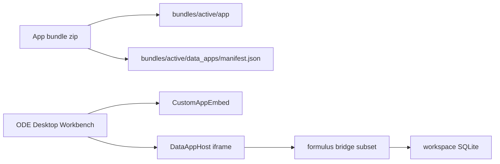

# Custom data-management apps (ODE Desktop backlog)

**Status:** design only — not implemented.

## Goal

Load optional **custom data-management mini-apps** in the ODE Desktop Workbench alongside the Synkronus-downloaded **custom_app** bundle. These tools support study stewards and developers who need specialized UIs that are not part of the field collection app:

- Choice-list CRUD stored as observations
- Randomization administration
- Data cleaning / QA workflows
- Export prep or one-off transforms

Field enumerators continue to use the **custom_app** (e.g. GBMIS) in Formulus. Data-management apps are for **desktop custody** work against the same workspace SQLite database.

## Relationship to existing Workbench surfaces

| Surface                                  | Audience              | Data path                                       |
| ---------------------------------------- | --------------------- | ----------------------------------------------- |
| **Custom app** (`/workbench/custom-app`) | Field workflow mirror | `bundles/active/app/` or dev mirror             |
| **Form preview**                         | Form authors          | `bundles/active/forms/` + formplayer            |
| **Observations** (Data management)       | Custodians            | Workspace DB via Tauri                          |
| **Data apps** (proposed)                 | Study admins / devs   | Bundle-shipped HTML + same bridge as custom app |

## Proposed bundle layout

```
bundles/active/
  app/                    # existing custom_app (field)
  forms/                  # existing forms
  data_apps/
    manifest.json         # registry
    choice_admin/
      index.html
    randomization/
      index.html
```

Example `manifest.json`:

```json
{
  "dataApps": [
    {
      "id": "choice_admin",
      "title": "Choice list editor",
      "entry": "data_apps/choice_admin/index.html",
      "description": "Edit shared lookup observations"
    }
  ]
}
```

Synkronus bundle upload would include `data_apps/` when present; Desktop scans the active bundle on load.

## Runtime architecture



### Host components (to build)

1. **`DataAppManifestLoader`** — read `bundles/active/data_apps/manifest.json` (and dev mirror equivalent when developer mode mirrors `data_apps/`).
2. **`DataAppHostPage`** — route `/workbench/data-apps/:id`; embed via reused `CustomAppEmbed` pattern with `indexRelativePath` pointing at manifest `entry`.
3. **Navigation** — sidebar or Bundles page section listing registered data apps for the active bundle.
4. **Bridge** — reuse [`formPreviewBridge.ts`](../src/lib/formPreviewBridge.ts) + `formulus-injection.js`. Subset is sufficient for admin tools:
   - `getObservations` / `getObservationsByQuery`
   - `persistObservation` (headless writes)
   - `submitObservation` / `updateObservation` (optional finalize dialog)
   - `sync` (when implemented on Desktop)
   - `getCustomAppUri` / `getFormSpecsUri` (if app needs form specs)
   - Stub or omit device APIs (camera, QR, GPS)

### Security model

- Load HTML **only** from paths declared in the signed bundle manifest (same trust model as `custom_app`).
- No arbitrary folder picker for data apps (unlike developer-mode custom app mirror).
- Data apps run in an iframe with the same `ReactNativeWebView` shim as the field custom app.

## Developer mode

When **custom app developer mode** is on, optionally mirror `data_apps/` from the local source folder if present (`<localFolder>/data_apps/`). Same pattern as `bundles/dev-local/app/` today.

## Open questions

1. Should data apps ship in the **same** Synkronus zip as the field app, or as a separate bundle type?
2. Manifest versioning and compatibility checks (bridge API version).
3. Whether data apps need Formplayer embed (nested forms) or only observation CRUD.
4. Portal UI for uploading / validating `data_apps/manifest.json`.

## References

- [desktop/AGENTS.md](../AGENTS.md) — Workbench layout, developer mode, bridge
- [formPreviewBridge.ts](../src/lib/formPreviewBridge.ts) — bridge message matrix
- Formulus `FormulusInterfaceDefinition.ts` — contract source of truth
