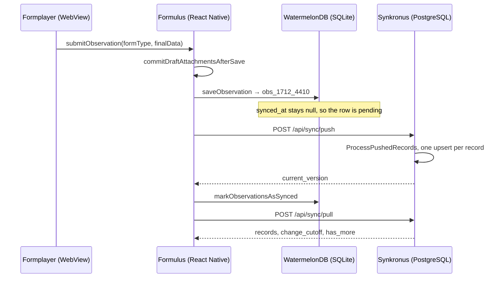

# Follow one observation through ODE

Pick a single observation — a tree measured in the rain — and follow it from the
form on a phone to PostgreSQL and back out again as an export. This is a code
map for newcomers, not a protocol specification: every step names a real symbol
you can open, and the [tests](#prove-it-to-yourself) at the end prove the same
path behaves as described.

## The happy path

## Where each step lives

| # | Step | Project | Source |
|---|------|---------|--------|
| 1 | Render the JSON form | Formulus Formplayer | [`App.tsx`](https://github.com/OpenDataEnsemble/ode/blob/dev/formulus-formplayer/src/App.tsx) — renderer registry and `App` |
| 2 | Finalize the session | Formulus Formplayer | [`FinalizeRenderer.tsx`](https://github.com/OpenDataEnsemble/ode/blob/dev/formulus-formplayer/src/renderers/FinalizeRenderer.tsx) — `handleFinalize` dispatches a `finalizeForm` event |
| 3 | Cross the WebView bridge | Formplayer → Formulus | [`FormulusInterface.ts`](https://github.com/OpenDataEnsemble/ode/blob/dev/formulus-formplayer/src/services/FormulusInterface.ts) — `submitObservationWithContext`; the contract lives in [`FormulusInterfaceDefinition.ts`](https://github.com/OpenDataEnsemble/ode/blob/dev/formulus/src/webview/FormulusInterfaceDefinition.ts) |
| 4 | Receive it natively | Formulus | [`FormulusMessageHandlers.ts`](https://github.com/OpenDataEnsemble/ode/blob/dev/formulus/src/webview/FormulusMessageHandlers.ts) — `onSubmitObservation` delegates to the active session |
| 5 | Commit draft files, then write | Formulus | [`FormplayerModal.tsx`](https://github.com/OpenDataEnsemble/ode/blob/dev/formulus/src/components/FormplayerModal.tsx) — `handleSubmission`, then [`attachmentStorage.ts`](https://github.com/OpenDataEnsemble/ode/blob/dev/formulus/src/services/attachmentStorage.ts) — `persistObservationWithAttachments` |
| 6 | Create the local row | Formulus | [`WatermelonDBRepo.ts`](https://github.com/OpenDataEnsemble/ode/blob/dev/formulus/src/database/repositories/WatermelonDBRepo.ts) — `saveObservation`; table shape in [`schema.ts`](https://github.com/OpenDataEnsemble/ode/blob/dev/formulus/src/database/schema.ts) |
| 7 | Push a batch | Formulus | [`SyncService.ts`](https://github.com/OpenDataEnsemble/ode/blob/dev/formulus/src/services/SyncService.ts) — `syncObservations`, and [`api/synkronus/index.ts`](https://github.com/OpenDataEnsemble/ode/blob/dev/formulus/src/api/synkronus/index.ts) for the HTTP call |
| 8 | Apply the batch | Synkronus | [`handlers/sync.go`](https://github.com/OpenDataEnsemble/ode/blob/dev/synkronus/internal/handlers/sync.go) — `Push`; [`pkg/sync/service.go`](https://github.com/OpenDataEnsemble/ode/blob/dev/synkronus/pkg/sync/service.go) — `ProcessPushedRecords` |
| 9 | Pull, then apply | Synkronus → Formulus | `GetRecordsSinceVersion` in the same service file, then `applyServerChanges` in `WatermelonDBRepo.ts` |
| 10 | Export | Synkronus | [`pkg/dataexport/service.go`](https://github.com/OpenDataEnsemble/ode/blob/dev/synkronus/pkg/dataexport/service.go) — `ExportParquetZip` and `ExportRawJSONZip` |

## What changes when the device is offline

Nothing in the write path talks to the network. `saveObservation` resolves a
cached location, reads who is submitting, and writes one row to SQLite — so the
form is complete and durable with the radio off. "Pending" is not a stored
state; it is a derived query over `synced_at` and `updated_at` in
`getPendingChanges`, which is why a push that fails part-way leaves the
unacknowledged rows eligible for the next attempt. The server is the only place
rows merge: `ProcessPushedRecords` wraps a batch in one transaction and upserts
on `observation_id`, so re-sending a batch is safe.

## Attachments travel a separate pipeline

Observation JSON never carries a file. A `photo`, `audio`, or `video` answer
persists a GUID-shaped basename — for example `9f1c….jpg` — plus metadata,
while the binary lives on disk under the profile's `attachments/` directory in
`draft/`, `pending/`, and `synced/` subfolders. Those files move over
`PUT /api/attachments/{attachment_id}` and are announced by
`POST /api/attachments/manifest`, recorded in the `attachment_operations` table
and tracked on their own version cursor. The practical consequence: an
observation can be fully synced on the server while its photo is still queued on
the device.

## Prove it to yourself

| Test | What it proves |
|------|----------------|
| [`attachmentStorage.test.ts`](https://github.com/OpenDataEnsemble/ode/blob/dev/formulus/src/services/__tests__/attachmentStorage.test.ts) — *calls commitDraftAttachmentsAfterSave and saveObservation for a new observation* | Draft files are promoted before the row is written, and the committed data is what reaches the repository |
| [`WatermelonDBRepo.test.ts`](https://github.com/OpenDataEnsemble/ode/blob/dev/formulus/src/database/repositories/__tests__/WatermelonDBRepo.test.ts) — *saveObservation should create a new observation and return its ID* | The local row is created, readable, and addressable by its id |
| [`sync_push_pull_test.go`](https://github.com/OpenDataEnsemble/ode/blob/dev/synkronus/internal/handlers/sync_push_pull_test.go) — `TestPushThenPull` | The server accepts a push and hands the same observations back on a pull (needs PostgreSQL) |
| [`attachmentManifestResume.test.ts`](https://github.com/OpenDataEnsemble/ode/blob/dev/formulus/src/api/synkronus/__tests__/attachmentManifestResume.test.ts) — *advances attachment cursor and defers failed downloads for future syncs* | Attachment progress uses its own cursor and survives a failed download |
| [`attachment_sync_integration_test.go`](https://github.com/OpenDataEnsemble/ode/blob/dev/synkronus/internal/handlers/attachment_sync_integration_test.go) — `TestAttachmentUpload_FollowedByManifest_ReturnsDownloadForSecondDevice` | An uploaded attachment becomes discoverable to a second device independently of observation sync (needs PostgreSQL) |

## What this map leaves out

- **Conflict handling.** When a pulled server row is older than the local copy,
  the local row wins and is tagged `last_write_won` in `WatermelonDBRepo.ts`.
  The full conflict matrix is not covered here.
- **Repository reset.** An admin reset bumps `repository_generation`; clients
  that sent an older value receive HTTP 409 rather than silently merging.
- **Attachment depth.** The manifest, upload queue, and download pool are
  summarized; their retry and prefetch logic deserves its own map.
- **Sync triggering.** How a sync is started from the UI is not part of this
  journey.
- **`form_version`.** The column is stored and pushed on both sides, but how a
  form's schema version is chosen is a separate question from where an
  observation travels.
