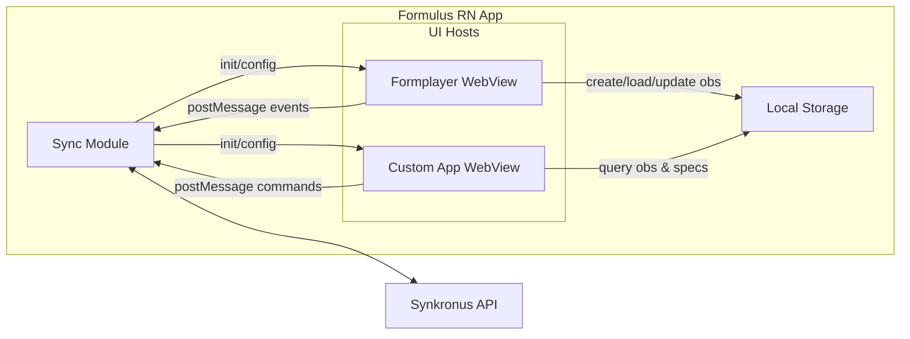

# Formulus Formplayer

This app implements the core functionality to render and submit forms to Formulus (which can then sync with Synkronus).

# Usage in custom apps

Primarily the formplayer exposes a javascript interface, that is injected into the custom app and can be used to render forms based on the jsonform spec's provided by formulus (formulus downloads the jsonform spec's and optional bundle-local **question_types** from Synkronus). Built-in controls — including **`format: sub-observation`** for embedded repeats on the parent observation — ship inside Formplayer; additional formats can still be supplied via **`question_types/*/renderer.js`** in the app bundle and are merged at initialization.

## Responsibility of the Formulus Formplayer

The formplayer is solely responsible for

- rendering the forms
  - create new observations
  - edit existing observations
  - validate form responses
- loading previously saved data (if the form is opened with a valid observation_id)
- submitting the forms to Formulus (either as draft or final)
- (soft-)deleting observations

## Development setup

This project depends on `@ode/tokens` (local `packages/tokens`). On a fresh clone or new branch, install in order:

1. From repo root: `cd packages/tokens && pnpm install`
2. Then: `cd formulus-formplayer && pnpm install && pnpm start`

If you run `pnpm install` only in formulus-formplayer, the tokens package’s `prepare` script may fail with "Cannot find module 'style-dictionary'" until tokens has its own dependencies installed.

## Building this project

Use `pnpm run build:copy` to build the project and copy the bundle into the Formulus app (Android + iOS) and ODE Desktop (`desktop/public/formplayer_dist/`).

## Javascript interface

The javascript interface made available to the custom app is as follows:

```javascript
window.formulus.formplayer = {
   addObservation(formType, initializationData)
   editObservation(formType, observationId)
   ~~~deleteObservation(formType, observationId)~~~ // TODO: Will be implemented in formulus core interface
   ...
}
```

### addObservation

```javascript
window.formulus.addObservation(formType, initializationData);
```

formType: The type of the form to be rendered. Notice that formulus will always use the latest version of a form to render the form.
initializationData: An object containing any initialization data that should be passed to the form

### editObservation

```javascript
window.formulus.editObservation(formType, observationId);
```

formType: The type of the form to be rendered. Editing an existing observation will always use the version of the form that was used to create the observation.
observationId: The id of the observation to be edited

### deleteObservation

```javascript
window.formulus.deleteObservation(formType, observationId);
```

formType: The type of the form to be rendered
observationId: The id of the observation to be deleted

## Form init `params` vs observation data

The React Native host passes `FormInitData` into the WebView (including `params` and optional `savedData`). Observation JSON must not pick up bridge/UI-only fields.

- **Prefills**: Use `params.defaultData` as a plain object whose keys match the form’s JSON Schema root `properties`.
- **Reserved top-level `params` keys** (not treated as observation fields): `defaultData`, `theme`, `darkMode`, `themeColors`. If the host adds more non-data parameters later, the formplayer’s `FORMPARAMS_NON_DATA_KEYS` in `src/utils/formObservationData.ts` should be extended in lockstep.
- **Legacy prefills**: If `defaultData` is missing, the formplayer copies other top-level `params` keys except the reserved keys above.
- **Sanitization**: When the schema defines non-empty root `properties`, loaded and submitted data are filtered to those keys plus `locale` (so older polluted rows are cleaned on edit/save). Schemas with missing or empty root `properties` pass data through unchanged.

## Custom validators that mutate data

Custom validators (`ui.json` → `options.customValidators`) may **mutate** `data` in place (e.g. auto-numbering embedded sub-observation rows). After each change and before finalize, Formplayer re-dispatches form state when mutations are detected so sub-observation tables and computed displays update immediately.

**Per-session scope:** Validators run only in the **active** Formplayer session. A validator on the root form does not run when the enumerator adds a row inside an open **child** sub-observation form. For multi-level embedded trees, attach validators on **each** form where rows are added. Author docs: [Custom Extensions — nested sessions](https://opendataensemble.org/docs/guides/custom-extensions#nested-sessions-and-custom-validators).

## Sub-observation `skipFinalize`

`skipFinalize` **omits the Finalize page** only. **Done** on the last content page still runs AJV + that form’s custom validators, then returns `formData` to the parent via `SubObservationQuestionRenderer`. Parent-level validators (denormalized indexes, global numbering) do not run in the child session. See [Custom Extensions — validation and skipFinalize](https://opendataensemble.org/docs/guides/custom-extensions#validation-and-skipfinalize).

## Sub-observation `parentKey`

`format: "sub-observation"` requires **`linkedForm`** only. **`parentKey`** is optional: when set, the parent value is injected into the child session on add; when omitted, the embedded repeat model relies on data already nested in the parent JSON.

## `skipDraftSelection`

Root forms with saved drafts normally show **DraftSelector** on open. Custom apps that orchestrate the session can bypass it:

```javascript
await formulus.openFormplayer(
  'inclusion_decision',
  { defaultData: payload },
  {},
  { skipDraftSelection: true, skipFinalize: true },
);
```

Same flag is available on `FormInitData.skipDraftSelection` from the native host. Sub-observation sessions never offer the draft picker.

## Initialization

The formulus formplayer object will be initialized by the formulus app. The formulus app will inject the initialized formulus object into the custom app, hence **the custom app does not need to do anything to initialize the formulus object**.

```javascript
new formulus.formplayer(config);
```

config: An object containing the configuration for the formulus formplayer object. The config object should have the following properties:

- renderers: An array of renderers to be used by the formplayer. Renderers are container components responsible for rendering the form.
- cells: An array of cells to be used by the formplayer. Cells maps to `question types` and are components responsible for handling specific input types - e.g. text input cell, date input cell, etc. Core formulus provides the following cells: - text cell - date cell - time cell - datetime cell - number cell - boolean cell - select cell - select multiple cell - file cell - image cell - signature cell - barcode cell - qr code cell - location cell
  Any other cells, either custom developed or provided by the community, will be included as well once they are downloaded from synkronus as part of the normal sync process.
- formSpecs: An array of jsonform formSpecs to be used by the formplayer wrapped in an envelope object: `{formType: string, version: string, spec: any}`

## Available `pnpm` scripts

In the project directory, you can run:

- `pnpm start` Runs the app in the development mode. Open [http://localhost:3000](http://localhost:3000) to view it in the browser.
- `pnpm test`. Launches the test runner in the interactive watch mode.
- `pnpm run build`. Builds the app for production to the `build` folder. It correctly bundles React in production mode and optimizes the build for the best performance.
- `pnpm run storybook` Starts the Storybook dev server. Open [http://localhost:6006](http://localhost:6006) to view the component stories.
- `pnpm run build-storybook` Builds a static Storybook for deployment.

The build is minified and the filenames include the hashes.



## SwipeLayout options (keyboard & header)

Forms that use a root `SwipeLayout` in `ui.json` support these `options`:

| Option                | Default | Description                                                                                       |
| --------------------- | ------- | ------------------------------------------------------------------------------------------------- |
| `autoFocusFirstInput` | `false` | When `true`, focuses the first text-like field each time the user changes page (legacy behavior). |
| `headerFields`        | `[]`    | Up to two field keys shown as context tags below the progress bar.                                |
| `headerTitle`         | —       | Optional inner title below the context bar.                                                       |

Per-control focus: set `options.autoFocus: true` on a `Control` to focus that field when its page is shown (takes precedence over `autoFocusFirstInput`).

### Header progress chevrons

On multi-page SwipeLayout forms, **Previous** / **Next** chevron buttons flank the progress bar (disabled on first/last page). They use the same navigation callbacks as the bottom bar.

### Group layout inside SwipeLayout

`Group` pages inside SwipeLayout render **flat** (no card panel) by default. Opt back into a card: `"options": { "variant": "card" }` on the Group.

Swipe gestures attach to the full scroll area (not only the question panel).

### Manual device regression matrix

After formplayer changes, verify on a phone WebView (or ODE Desktop form preview with keyboard):

| Scenario                                  | Pass criteria                                                |
| ----------------------------------------- | ------------------------------------------------------------ |
| Multi-page form header                    | Both chevrons visible; disabled at first/last page           |
| Group page (e.g. GBMIS Sticker / amostra) | Full-width layout; swipe works on background below questions |
| GBMIS `censo_milda_pessoa` → Anos         | No white scroll gap when typing digits                       |
| GBMIS `censo` → IME Next                  | No gap when moving field-to-field via keyboard Next          |
| `age_years` > 120                         | Single validation error via QuestionShell                    |

Rebuild formplayer (`pnpm run build:copy`) before testing in Formulus or Desktop developer mode.

## Validation error display

Built-in controls and custom question types wrapped by `CustomQuestionTypeAdapter` show validation messages **once** in `QuestionShell` (error alert with icon below the field). Child widgets should use `error` / `validation.error` for red borders only — do not also render `validation.message` as `helperText` or inline copy.

**Manual check (device):** trigger a required-field error on a shared `$ref` dropdown (e.g. GBMIS `censo_milda` → Iniciais do inquiridor), a plain string, and a custom `int` / `count_stepper` field — each should show **one** message with the exclamation icon, not duplicate text at the control.
