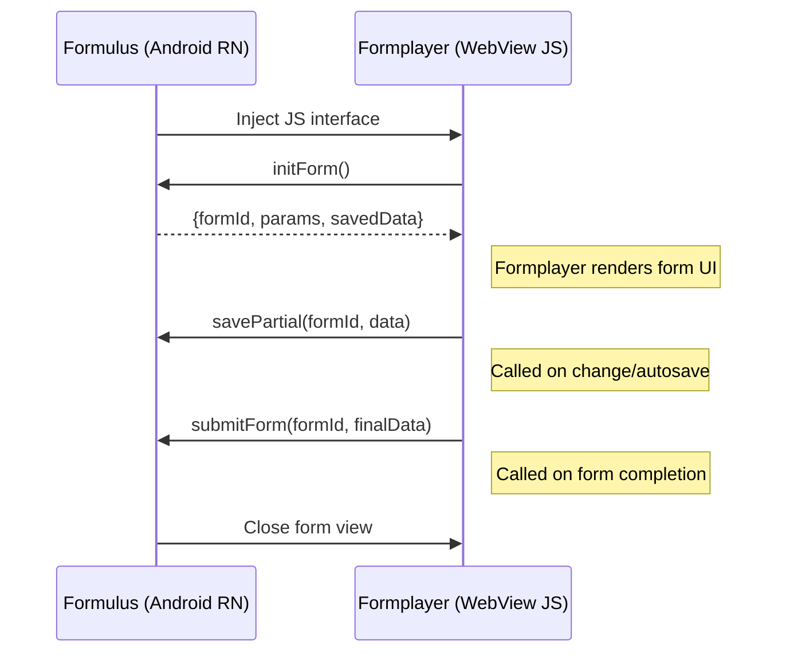
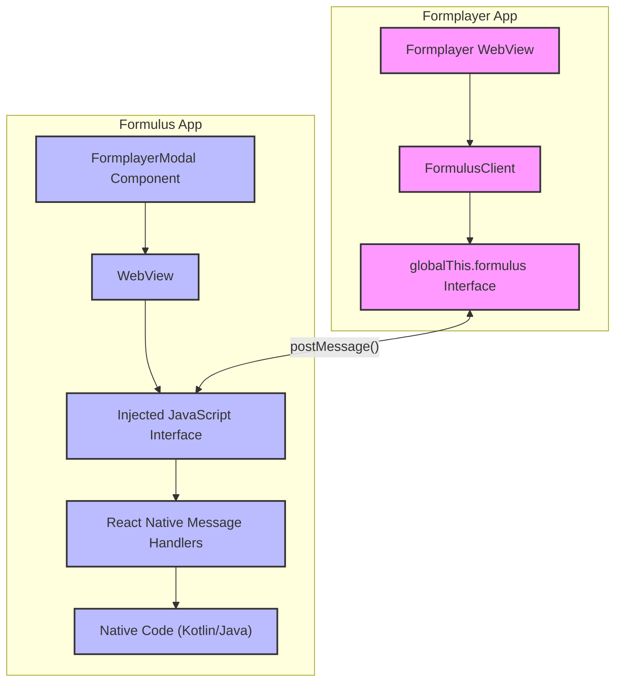

# Formulus <-> Formplayer Communication

## Simplified Sequence Diagram




## Canonical Sequence Diagram
```mermaid
sequenceDiagram
    participant Formplayer as Formplayer (WebView JS)
    participant Formulus as Formulus (React Native)

    %% Initialization (Formulus Initiated when FormplayerModal becomes visible with initialConfig)
    Note over Formulus,Formplayer: FormplayerModal becomes visible (e.g., triggered by CustomAppWebView message)
    Formulus->>Formplayer: Calls window.onFormInit({ formId, params, savedData, formSchema, uiSchema })
    Note right of Formplayer: Formplayer's onFormInit handler receives schemas & data, then renders the form UI.
    Formplayer-->>Formulus: (Optional) formplayerInitialized (message to confirm init)

    %% Form Interaction (these can leverage the promise-based communication)
    Note over Formplayer,Formulus: User interacts with the form in Formplayer
    Formplayer->>Formulus: savePartial({ type: 'savePartial', payload: {formId, data} }) (using postMessageWithPromise)
    Formulus-->>Formplayer: { success: true/false, message?: string } (Promise resolved/rejected to savePartial call)
    Note right of Formplayer: Called on field change/autosave

    Formplayer->>Formulus: submitForm({ type: 'submitForm', payload: {formId, finalData} }) (using postMessageWithPromise)
    Formulus-->>Formplayer: { submissionId?: string, error?: string } (Promise resolved/rejected to submitForm call)
    Note right of Formplayer: Called on explicit form submission

    %% Native feature calls (can happen anytime, example)
    alt Camera
        Formplayer->>Formulus: requestCamera({ type: 'requestCamera', payload: {fieldId} }) (using postMessageWithPromise)
        Formulus->>Formulus: Open camera, handle permissions
        Formulus-->>Formplayer: { fieldId, type: "image", uri } (Promise resolved to requestCamera call)

    %% Form Close (can be initiated by either side)
    Formplayer->>Formulus: requestCloseForm({ type: 'requestClose' }) (using postMessageWithPromise)
    Formulus-->>Formplayer: { status: 'closing' } (Promise resolved)
    Note over Formulus,Formplayer: Formulus closes the FormplayerModal

    alt File Picker
        Formplayer->>Formulus: requestFile(fieldId)
        Formulus->>Formulus: Open file picker
        Formulus->>Formplayer: onAttachmentReady({ fieldId, type: "file", uri })
    end

    alt Android Intent
        Formplayer->>Formulus: launchIntent(fieldId, intentSpec)
        Formulus->>Formulus: Start intent activity
        Formulus->>Formplayer: onAttachmentReady({ fieldId, type: "intent", data })
    end

    alt Subform
        Formplayer->>Formulus: callSubform(fieldId, formId, options)
        Formulus->>Formulus: Open subform view
        Formulus->>Formplayer: onAttachmentReady({ fieldId, type: "subform", data })
    end

    alt Audio Recording
        Formplayer->>Formulus: requestAudio(fieldId)
        Formulus->>Formulus: Record audio
        Formulus->>Formplayer: onAttachmentReady({ fieldId, type: "audio", uri })
    end

    alt Signature
        Formplayer->>Formulus: requestSignature(fieldId)
        Formulus->>Formulus: Capture signature
        Formulus->>Formplayer: onAttachmentReady({ fieldId, type: "signature", image })
    end

    alt Biometric Auth
        Formplayer->>Formulus: requestBiometric(fieldId)
        Formulus->>Formulus: Trigger biometric
        Formulus->>Formplayer: onAttachmentReady({ fieldId, type: "biometric", verified })
    end

    alt Connectivity Status
        Formplayer->>Formulus: requestConnectivityStatus()
        Formulus->>Formulus: Check network
        Formulus->>Formplayer: onAttachmentReady({ type: "connectivity", status })
    end

    alt Sync Info
        Formplayer->>Formulus: requestSyncStatus()
        Formulus->>Formulus: Get sync info
        Formulus->>Formplayer: onAttachmentReady({ type: "sync", progress })
    end

    alt Run ML Model
        Formplayer->>Formulus: runLocalModel(fieldId, modelId, input)
        Formulus->>Formulus: Run model
        Formulus->>Formplayer: onAttachmentReady({ fieldId, type: "ml_result", result })
    end

    %% Submission
    Formplayer->>Formulus: submitForm(formId, finalData)
    Formulus->>Formplayer: Close form view
```

### Components



#### Component Descriptions

1. **FormulusClient** - TypeScript client used by the formplayer app to communicate with Formulus
2. **globalThis.formulus Interface** - JavaScript interface injected into the WebView
3. **Formplayer WebView** - The WebView running the formplayer app
4. **FormplayerModal Component** - React Native component that creates and manages the WebView
5. **WebView** - The React Native WebView component
6. **Injected JavaScript Interface** - The JavaScript code injected into the WebView
7. **React Native Message Handlers** - Code that processes messages from the WebView
8. **Native Code** - Kotlin/Java code for native features (camera, location, etc.)
